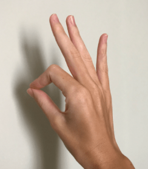

# Project-Airpercussions
The Airpercussions project was developed as part of the 
project work at the FH Technikum Wien in 2023. 
The aim is to navigate through the application using 
only hand gestures, and to produce sounds from various 
percussion instruments only by striking the air.

## Requirements
### Hardware
The Application runs only with a Luxonis OAK-D DephtAI 
stereo camera.
### Software
Python IDE (eg. Pycharm)
Python 3.10.0

Required libraries and modules:
see requirements.txt
## Run
Run the app from main.py in the IDE
## Camera position
## Navigate
In the Main-window and Select-Window use this poses:

Move mouse:

Mouse Click: Pose Fist

It is also possible to use the mouse.
## Play
Move the flat hand back and forth. When the hand marks 
the instrument, it turns red. 
Then simply make a relatively quick striking movement. 
To return to the instrument selection, press the tip 
of the pointer finger and the tip of the thumb together.

It is recommended to display the camera image 
during the first attempts.

