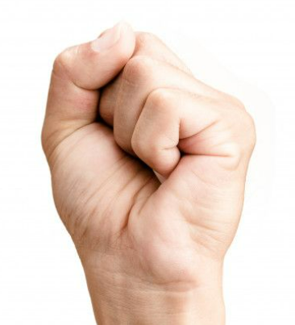

# Project-Airpercussions
The Airpercussions project was developed as part of the 
project work at the FH Technikum Wien in 2023. 
The aim is to navigate through the application using 
only hand gestures, and to produce sounds from various 
percussion instruments only by striking the air.
Handtracker was used and modified 
from the examples 
https://github.com/geaxgx/depthai_hand_tracker

## Requirements
### Hardware
The Application runs only with a Luxonis OAK-D DephtAI 
stereo camera.
### Software
Python IDE (eg. Pycharm)
Python 3.10.0

Required libraries and modules:
see requirements.txt
## Run
Run the app from main.py in the IDE
## Camera position
The camera should be at least 50cm and 
at most 70cm away from the hand.
## Navigate
In the Main-window and Select-Window use this poses:

Move mouse:

Mouse Click: Pose Fist

In the percussion windows:
For the game instruments, simply move the flat hand 
back and forth. 
The mouse function does not work in this mode.

It is also possible to use the computer mouse.
## Play
Move the flat hand back and forth. When the hand marks 
the instrument, it turns red. 
Then simply make a relatively quick striking movement. 
Playing is possible with one hand, and as it stands now,
timpanis, bongos and timbales can be played with two hands.
Drumset is not ready with the current state.
To return to the instrument selection, press the tip 
of the middle finger and the tip of the thumb together.

## Help
It is recommended to display the camera image 
during the first attempts.
To display the camera image, 
please delete the comment of the line 190 in 
HandTrackerRenderer.py.
cv2.imshow("Hand tracking", self.frame)

Airpercussions is a game but also a "musical instrument". 
Without practising, it's only half as much fun.

